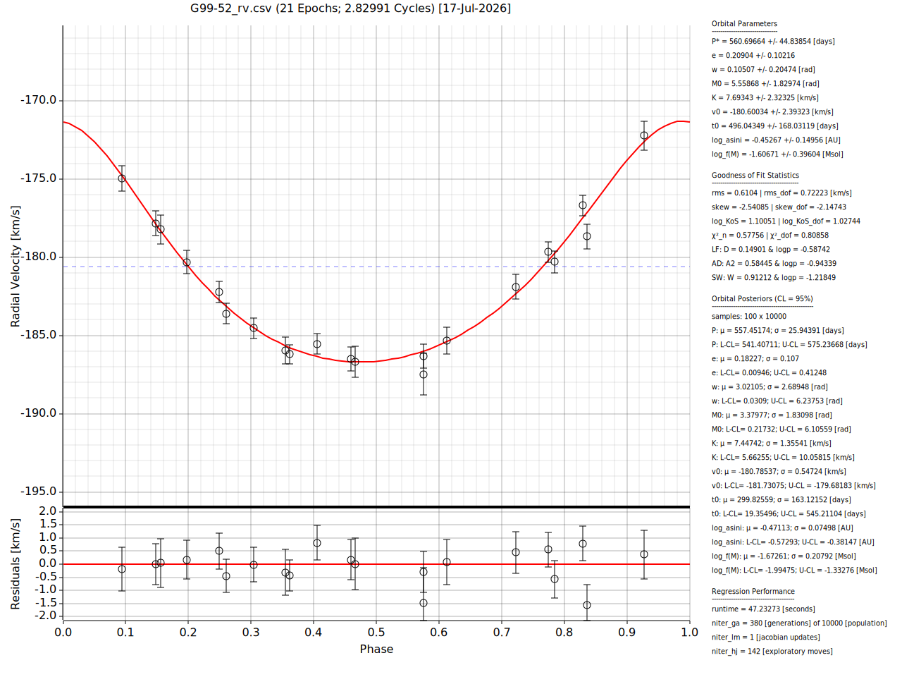

<div align="center">  </div>


## Synopsis:

Radial Velocity Two-Body (RV2B) is a command-line interface (CLI) tool designed to greatly simplify the process of accurately determining the best-fit Keplerian elements for a given set of RV observations. This is achieved via intelligent brute force by handling the necessary nonlinear regression with powerful convergence algorithms. The entire code is written in Rust and is consequently highly performant and memory efficient.


## RV2B Algorithms:

1. Generalized Lomb-Scargle Periodogram [Period Estimation]
2. Latin Hypercube [*R*<sup>n</sup> Stratified Initialization]
3. Halley's Method [Mean Anomaly -> Eccentric Anomaly]
4. Self-Adaptive Genetic Algorithm + Simple Linear Regression [Evolutionary Global Convergence]
5. Levenberg-Marquardt [Derivative Local Convergence]
6. Hooke-Jeeves [Non-Derivative Local Convergence]
7. Metropolis-Hastings [Posterior Sampling]

## Installation:

Installation of RV2B on your machine is done in 3 simple steps.

1. Install the Rust programming language on your machine by following the instructions at https://rust-lang.org/tools/install/. This should be simple and fast (a few minutes) for most operating systems.
2. Use the "Code" button on this page to download the "rv2b-main.zip" folder containing the source files for the software and unzip it wherever you would like the code to live.
3. Go into the "rv2b-main" folder and compile the code with ```cargo build --release``` and wait for the compilation to finish. Once it is done, RV2B is installed! 
   
To check if the installation worked, run ```./target/release/rv2b -h``` in the "rv2b-main" directory and check that CLI arguments are printed to the screen. If CLI arguments aren't printed, make sure the previous steps were followed carefully. If the code is still not functional, email dmdixon1992@gmail.com for further help.

## Basic Use:

RV2B defaults were carefully chosen to minimize the need to manually set most CLI arguments for basic use cases. This can be illustrated with some RV data included in the repository. The included RV time series data were published by the study of [Latham et al. (2002)](https://ui.adsabs.harvard.edu/abs/2002AJ....124.1144L/abstract), and [the catalog](https://vizier.cds.unistra.fr/viz-bin/VizieR?-source=J/AJ/124/1144) of the 171 systems is hosted by the VizieR astronomy catalog service. For a bare-bones example, you can use the following commands to unzip the folder containing the Latham data (Latham_2002_171_SB1s.zip) and solve the orbit of target G99-52.

```unzip Latham_2002_171_SB1s.zip```

```./target/release/rv2b -i ./Latham_2002_171_SB1s/G99-52_rv.csv```

This will attempt to fit the data in "./Latham_2002_171_SB1s/G99-52_rv.csv" with the default CLI arguments. By default, RV2B will output a plot depicting the model fit and save it to disk. The following image is such a plot and shows an example default fit for G99-52.


<p align="center"><b>Example of a default fit for Latham target G99-52.</b></p> 

All RV data files for RV2B must be in a single character (like a comma) text-delimited file of 2 or 3 columns in order of time, radial velocity, and radial velocity error (optional), respectively. All other file formats will fail! An example of a space-delimited RV data file with column names would look something like.

```./target/release/rv2b -i some_single_spaced_rv_data.txt -d " " -n true```

Some solutions for the Latham dataset with default settings can take well over a minute to run on a typical laptop CPU. However, this is mostly due to the default Genetic Algorithm being significantly overtuned for well-sampled targets. This is done to have extra robustness against early local convergence as a default behavior, but in many cases, it is overkill. For example, just refitting G99-52 with a Genetic Algorithm population of 1,000 (default: population = 10,000) and turning off the self-adaptation by setting the factor to unity (sbx self adaptive factor = 1.0) or setting equal boundaries for the distribution index (default: minimum sbx distribution index = 1.0 & maximum sbx distribution index = 10.0) substantially lowers the runtime to around a few seconds, but will still generally return the same (within uncertainties) solution.

```./target/release/rv2b -i ./Latham_2002_171_SB1s/G99-52_rv.csv -p 1000 --min_sbx_di 2 --sbx_saf 1```

or

```./target/release/rv2b -i ./Latham_2002_171_SB1s/G99-52_rv.csv -p 1000 --min_sbx_di 2 --max_sbx_di 2```

By its nature, self-adaptation requires doubling the model evaluations in the Genetic Algorithm, so having it on will asymptotically increase runtimes by 2x as population and/or generation sizes grow. When turned off, it is advised to set the distribution index to 2 (starts at minimum) as shown above, which is a more effective value when remaining constant.

There isn't a single combination of computationally conservative RV2B arguments that is known a priori to minimize the runtime and still get an accurate solution for every use case. For interactive investigations of single targets, it may be best to start small and progressively ramp up on runtime as needed. If working with a large number of RV curves, the CLI format of RV2B is highly amenable to code wrapping, so pipeline logic handled by scripting (Python, Bash, etc.) can be used to automate a refitting procedure to improve the accuracy of best-fit solutions while minimizing their aggregate runtimes. However, allowing the code to run for up to a few minutes (if needed) to be more certain of an initial high-quality solution is the easiest approach if waiting time is not a concern.

Here is a short checklist one can go through on the RV2B outputs that may explain why RV2B initially finds poor orbital solutions ($\chi^2$ >> 1 and/or large RMS) and could suggest refitting or more RV data is needed:

* No robust Generalized Lomb-Scargle period.
* Low number of observations (nobs < 15).
* Period smaller than pseudo-Nyquist period (P < ps_nyq_per).
* Low number of orbital cycles (ncycles < 3).
* Very large parameter uncertainties.
* Very high eccentricity (e > 0.7).
* Near-circular orbit (e ~ 0).
* Sparse data sampling of orbital phase (max_phase_gap > 0.3).

To fit simultaneous solutions with multiprocessing, you can use -l to run a file listing the file paths for each RV data file on separate lines. A simple example using the included Latham dataset is the following.

```./target/release/rv2b -l ./Latham_2002_171_SB1s_filepaths.txt```

**Note:** 15/171 of the Latham targets only have preliminary published solutions due to a lack of data.

By default, all outputs will be saved in a folder called "rv2b_outputs". This includes general solution information, which is by default saved in the "solutions_table.csv" file. The description of the solution table fields can be found in the [RV2B solution fields table](https://github.com/dmdixon/rv2b/blob/main/rv2b_solution_fields.md). Additionally, the solution residuals and a plot of the RV data with the fitted model are saved by default. 

See the [RV2B arguments table](https://github.com/dmdixon/rv2b/blob/main/rv2b_arguments.md) or use ./target/release/rv2b -h to learn more about all of the RV2B arguments!
